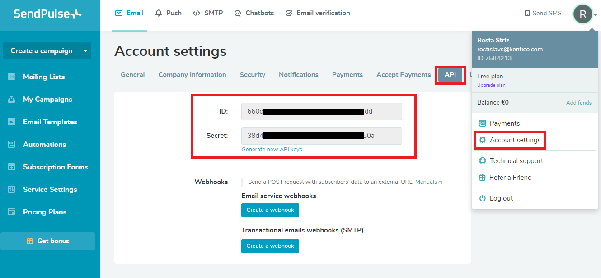

[![Core integration][core-shield]](https://kontent.ai/integrations/sendpulse)
[![Gallery][gallery-shield]](https://kentico.github.io/kontent-custom-element-samples/gallery/)

![Last modified][last-commit]
[![Issues][issues-shield]][issues-url]
[![Contributors][contributors-shield]][contributors-url]
[![Forks][forks-shield]][forks-url]
[![MIT License][license-shield]][license-url]

[![Stack Overflow][stack-shield]](https://stackoverflow.com/tags/kentico-kontent)
[![GitHub Discussions][discussion-shield]](https://github.com/Kentico/Home/discussions)

<p align="center">
<image src="docs/01-kk-logo-main.svg" alt="kontent logo" width="300" />
<image src="docs/sendpulse-logo.png" 
alt="sendpulse logo" width="400">
</p>

<p align="center">
  <a href="#features">Features</a> •
  <a href="#demo">Demo</a> •
  <a href="#quick-deploy">Deploy</a> •
  <a href="#setup">Setup</a> •
  <a href="#what-is-saved">Saved value</a> •
  <a href="#contributors">Contributors</a> •
  <a href="#license">License</a> •
  <a href="#additional-resources">Resources</a>
</p>

This repository contains the source code of SendPulse mailing list selector custom element for Kentico Kontent. 

## Features
The custom element allows linking a ceratin mailing list from Sendpulse with your content in Kentico Kontent. This allows for linking together pages/forms with specific mailing lists in order to add collected contacts to those maling lists. 

When an mailing list is selected, its ID can be used in a POST request to SendPulse to add one or multiple email adresses to the mailing list. **The POST request is not part of the custom element.**

## Demo

![Demo Animation][product-demo]

## Quick Deploy

Netlify has made this easy. If you click the deploy button below, it will guide you through the process of deploying it to Netlify and leave you with a copy of the repository in your account as well.

[](https://app.netlify.com/start/deploy?repository=https://github.com/Kentico/kontent-custom-element-sendpulse)


## Setup
1. ### Get your API credentials from Sendpulse account
    You'll need to login into your Sendpulse account. Then navigate into **Account settings** -> **API** where you'll see your **ID** and **Secret**, which are the two settings needed for the integration to work. 



2. ### Netlify/server setup
    Since you don't want to store the API secret inside of the custom element config, we are using [Netlify function](https://docs.netlify.com/functions/overview/) to act as a proxy between your custom element and the Sendpulse API. In order to make the function work, you'll need to provide it with the **Secret** you obtained in the previous step. For that, we'll use Netlify's [Build enrionment variable](https://docs.netlify.com/configure-builds/environment-variables/). The only issue with these variables are that they are being loaded on build, so whenever you **change the variables**, you'll need to **manually trigger a rebuild**. 

    The expected variable name for the function is `SENDUPLSE_API_SECRET`.

    How this all can be done is described in our [Kontent-Netlify example repository](https://github.com/Kentico/kontent-netlify-webhook-processor#setup), or can be observed on the animation below.


3. ### Configure the Custom Element 
    After your function is setup, you'll need to create and configure your Sendpulse custom element. The process of adding a custom element into your project is descripbed in [Kontent's official documentation](https://docs.kontent.ai/tutorials/develop-apps/integrate/content-editing-extensions#a-displaying-your-custom-editor-in-kentico-kontent). 

    The custom element has to be also configured. The neccessary configuration values are as follows:

```
{
    "apiId": "<YOUR SENDPULSE API ID>"
}

```
_The functionUrl should be equal to your custom element's Hosted URL with `/.netlify/functions/sendpulse-client` added to it (if you are using the provided quick deploy). If you decide to deploy the element differently, you'll have to update the element's code._

## What is Saved

Mailing lists are retrieved in an array of mailing list objects. After selecting a mailing list from SendPulse the object is saved in Kentico Kontent.
For more information see: https://sendpulse.com/br/integrations/api/bulk-email.

```
[
  {
    "id": "1",
    "name": "My first list",
    "all_email_qty": "1",
    "active_email_qty": "0",
    "inactive_email_qty": "1",
    "creationdate": "2015-04-20 08:52:40",
    "status": "0",
    "status_explain": "Active"
  },
  {
    "id": "2",
    "name": "My second list",
    "all_email_qty": "6",
    "active_email_qty": "0",
    "inactive_email_qty": "6",
    "creationdate": "2015-04-20 09:02:39",
    "status": "0",
    "status_explain": "Active"
  }
]
```

## Contributors
This custom element was originally created by <a href="https://www.truelime.nl/">TrueLime</a>.

<a href="https://github.com/Kentico/kontent-custom-element-sendpulse/graphs/contributors">
  
</a>

We have collected notes on how to contribute to this project in [CONTRIBUTING.md](CONTRIBUTING.md).

## License

[MIT](https://tldrlegal.com/license/mit-license)

## Additional Resources

- [Custom Element Gallery on github](https://kentico.github.io/kontent-custom-element-samples/gallery/)
- [Kentico Kontent's Integration documentation](https://docs.kontent.ai/tutorials/develop-apps/integrate/integrations-overview)
- [Custom Element documentation](https://docs.kontent.ai/tutorials/develop-apps/integrate/content-editing-extensions)
- [Custom Element API reference](https://docs.kontent.ai/reference/custom-elements-js-api)


[last-commit]: https://img.shields.io/github/last-commit/Kentico/kontent-custom-element-sendpulse?style=for-the-badge
[contributors-shield]: https://img.shields.io/github/contributors/Kentico/kontent-custom-element-sendpulse.svg?style=for-the-badge
[contributors-url]: https://github.com/Kentico/kontent-custom-element-sendpulse/graphs/contributors
[forks-shield]: https://img.shields.io/github/forks/Kentico/kontent-custom-element-sendpulse.svg?style=for-the-badge
[forks-url]: https://github.com/Kentico/kontent-custom-element-sendpulse/network/members
[stars-shield]: https://img.shields.io/github/stars/Kentico/kontent-custom-element-sendpulse.svg?style=for-the-badge
[stars-url]: https://github.com/Kentico/kontent-custom-element-sendpulse/stargazers
[issues-shield]: https://img.shields.io/github/issues/Kentico/kontent-custom-element-sendpulse.svg?style=for-the-badge
[issues-url]: https://github.com/Kentico/kontent-custom-element-sendpulse/issues
[license-shield]: https://img.shields.io/github/license/Kentico/kontent-custom-element-sendpulse.svg?style=for-the-badge
[license-url]: https://github.com/Kentico/kontent-custom-element-sendpulse/blob/master/LICENSE
[core-shield]: https://img.shields.io/static/v1?label=&message=core%20integration&color=FF5733&style=for-the-badge
[gallery-shield]: https://img.shields.io/static/v1?label=&message=extension%20gallery&color=51bce0&style=for-the-badge
[stack-shield]: https://img.shields.io/badge/Stack%20Overflow-ASK%20NOW-FE7A16.svg?logo=stackoverflow&logoColor=white&style=for-the-badge
[discussion-shield]: https://img.shields.io/badge/GitHub-Discussions-FE7A16.svg?logo=github&style=for-the-badge
[product-demo]: docs/demo.gif?raw=true
